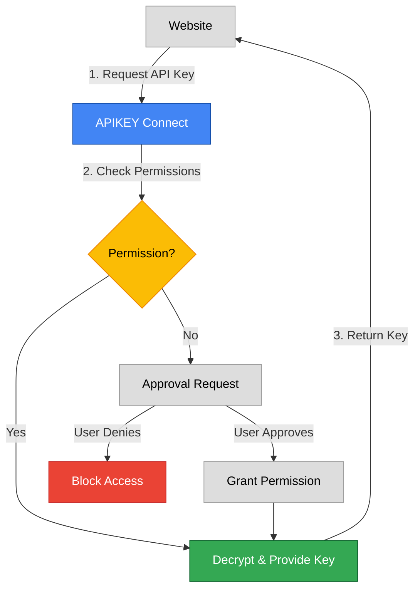

# 🔑 APIKEY Connect

<div align="center">


**Secure API Key Management with Enterprise-Grade Encryption**

</div>

## 📋 Table of Contents

- [🌟 Overview](#-overview)
- [✨ Key Features](#-key-features)
- [🎯 Why APIKEY Connect?](#-why-apikey-connect)
- [🚀 Quick Start](#-quick-start)
- [📱 Screenshot Tour](#-screenshot-tour)
- [🛡️ Security Features](#️-security-features)
- [🔍 How It Works](#-how-it-works)
- [🌐 Supported Services](#-supported-services)
- [📊 Usage Scenarios](#-usage-scenarios)
- [💼 For Teams](#-for-teams)
- [🆘 Troubleshooting](#-troubleshooting)
- [📜 FAQ](#-faq)

## 🌟 Overview

**APIKEY Connect** is a browser extension that securely stores and manages your API keys with enterprise-grade encryption. It creates a secure vault that protects your valuable API credentials while making them easily accessible to trusted websites and applications.

In today's development environment, API keys are the digital keys to valuable services and data. **APIKEY Connect** ensures these keys are never exposed or compromised, while still being readily available when you need them.

## ✨ Key Features

| Feature | Description |
|---------|-------------|
| 🔐 **Enterprise-Grade Encryption** | AES-GCM encryption with PBKDF2 key derivation |
| 👁️ **Zero Knowledge Architecture** | Your master password never leaves your device |
| 🔄 **Smart Auto-Approval** | Configure trusted sites for seamless workflow |
| 🛡️ **Granular Permissions** | Control exactly which sites can access specific keys |
| 🕒 **Auto-Lock** | Automatically lock vault after inactivity |
| 📦 **Secure Backup & Recovery** | Export/import encrypted backups |
| 🔍 **Usage Logs** | Monitor when and where your keys are used |
| 👥 **Team Integration** | Share selected keys with team members securely |
| 🌈 **Support for 60+ Services** | Pre-configured formats for popular API services |

## 🎯 Why APIKEY Connect?

### The Problem With API Keys

Most developers face these common challenges:

- **Insecure Storage**: Keys often end up in code, config files, or browser storage
- **Accidental Exposure**: Keys committed to public repositories or shared incorrectly
- **No Access Control**: Once a key is exposed, it's accessible to anyone who finds it
- **Manual Entry**: Constantly copy-pasting keys between environments is tedious and error-prone

### Our Solution

**APIKEY Connect** creates a secure vault for your API keys that:

1. **Encrypts** all keys with AES-GCM (the same encryption used by banks)
2. **Controls** which websites can access your keys
3. **Streamlines** the developer workflow with smart approval rules
4. **Monitors** all key usage to detect suspicious activity

## 🚀 Quick Start

### Installation

1. Install from the [Chrome Web Store](https://chrome.google.com/webstore/detail/apikey-connect/your-extension-id)
2. Click the 🔑 icon in your browser toolbar
3. Create a strong master password

### Adding Your First Key

1. Click the "+" button in the extension popup
2. Select a service (e.g., OpenAI, AWS, GitHub)
3. Enter your key name and value
4. Click "Add Key"

### Using Your Keys

When a website requests access to an API key:

1. You'll receive a notification
2. Review the request details
3. Approve or deny the request
4. Optionally, set up auto-approval for trusted sites


## 🛡️ Security Features

### Zero-Knowledge Architecture

Your master password never leaves your device and is never stored anywhere. We use PBKDF2 with 100,000 iterations to derive an encryption key, ensuring that even with physical access to your device, attackers cannot easily brute-force your vault.

### Encryption Details

| Component | Technology | Security Level |
|-----------|------------|----------------|
| **Encryption Algorithm** | AES-GCM | Military-grade |
| **Key Derivation** | PBKDF2 | 100,000 iterations |
| **Key Size** | 256-bit | Quantum-resistant |
| **Data Protection** | Per-key encryption | Compartmentalized security |
| **Storage** | Local browser storage | Data never leaves your device |

### Permissions System

Our granular permissions system allows you to:

- Control which websites can access specific keys
- Set permissions to expire automatically
- Require re-authentication for sensitive operations
- Revoke access at any time with a single click

## 🔍 How It Works

### The APIKEY Connect Workflow

1. **Storage**: Keys are encrypted with your master password and stored locally
2. **Request**: A website requests access to a specific API key
3. **Verification**: The extension checks if the site has permission
4. **Approval**: If no permission exists, you're prompted to approve/deny
5. **Access**: If approved, the key is decrypted and provided to the website
6. **Logging**: All access is logged for security auditing

### For Websites & Developers

Websites can request API keys using a simple JavaScript API:

```javascript
// Request an OpenAI API key
window.postMessage({
  type: "requestKey",
  serviceId: "openai",
  keyName: "Personal API Key" // Optional
}, "*");

// Listen for the response
window.addEventListener("message", (event) => {
  if (event.data.type === "keyResponse" && event.data.success) {
    const apiKey = event.data.key;
    // Use the API key securely
  }
});
```

## 🌐 Supported Services

APIKEY Connect supports 60+ popular API services out of the box:

### AI & Machine Learning
- OpenAI (ChatGPT, DALL-E)
- Anthropic (Claude)
- Hugging Face
- Stability AI
- Cohere
- Replicate
- Perplexity

### Cloud Services
- AWS
- Google Cloud
- Microsoft Azure
- DigitalOcean
- Cloudflare

### Development & Social
- GitHub
- GitLab
- Twitter/X
- Facebook
- Discord
- Reddit

### Payment & Financial
- Stripe
- PayPal
- Square
- Plaid

### And many more!

Each service includes validation patterns, security recommendations, and usage tips to help you use your keys safely and effectively.

## 📊 Usage Scenarios

### For Individual Developers

- **Local Development**: Safely use production API keys in localhost environments
- **Multiple Projects**: Organize keys by project and service
- **Key Rotation**: Easily update keys when rotating for security purposes
- **Safe Experimentation**: Try new APIs without exposing your credentials

### For Web Applications

- **SaaS Applications**: Securely access user-provided API keys
- **Browser Extensions**: Request API access without storing sensitive data
- **Development Tools**: Build tools that need to access various APIs

### For Teams & Organizations

- **Shared Access**: Create a secure vault of team API keys
- **Access Control**: Manage who can use which keys and when
- **Audit Trail**: Track key usage across the team
- **Security Compliance**: Meet security requirements with proper key management

## 💼 For Teams

APIKEY Connect offers team features that enable secure key sharing while maintaining control:

| Feature | Benefit |
|---------|---------|
| **Shared Key Vault** | Securely share selected keys with team members |
| **Role-Based Access** | Set permissions based on team roles |
| **Usage Logs** | Track key usage across your team |
| **Expiring Access** | Grant temporary access that automatically expires |
| **Admin Controls** | Centralized management of team keys and permissions |

## 🆘 Troubleshooting

### Common Issues

| Issue | Solution |
|-------|----------|
| **Forgotten Master Password** | Use your backup or reset the extension (keys will be lost without a backup) |
| **Website Not Detecting Extension** | Ensure the extension is enabled and refresh the page |
| **Key Not Being Accepted** | Verify the key format is correct for the service |
| **Approval Window Not Appearing** | Check browser notification settings and try again |
| **Extension Locked Unexpectedly** | Auto-lock feature engaged; simply unlock with your master password |

### Getting Help

- Email support at contact@bros.ai


## 📜 FAQ

### General Questions

<details>
<summary><b>Is APIKEY Connect free to use?</b></summary>
Yes, APIKEY Connect is free for individual use. We offer premium plans for teams and enterprises with advanced features.
</details>

<details>
<summary><b>Where are my keys stored?</b></summary>
Your encrypted API keys are stored locally in your browser's secure storage. They never leave your device unless you explicitly export a backup.
</details>

<details>
<summary><b>What happens if I forget my master password?</b></summary>
If you've created a backup, you can import it on a new installation. Without a backup, there is no way to recover your keys if you forget your master password - this is a security feature to ensure no one can bypass the encryption.
</details>

<details>
<summary><b>Is APIKEY Connect open source?</b></summary>
Yes, our core code is open source and available for review. We believe in transparency for security-critical applications.
</details>

### Technical Questions

<details>
<summary><b>How does the encryption work?</b></summary>
We use AES-GCM encryption with a key derived from your master password using PBKDF2 with 100,000 iterations. Each key is individually encrypted, and your master password never leaves your device.
</details>

<details>
<summary><b>Can websites steal my keys?</b></summary>
No. Websites must explicitly request access to specific keys, and you must approve each request. The permission model ensures that websites only get access to the exact keys you approve.
</details>

<details>
<summary><b>Does APIKEY Connect work with mobile browsers?</b></summary>
Currently, APIKEY Connect is designed for desktop browsers. Mobile browser support is on our roadmap.
</details>

<details>
<summary><b>How do I integrate APIKEY Connect with my website?</b></summary>
We provide a simple JavaScript API for requesting keys. See our [Developer Documentation](https://docs.apikeyconnect.com) for integration details.
</details>

---

<div align="center">
<p>Secure your API keys today!</p>
<p><a href="https://chromewebstore.google.com/detail/apikeyconnect/edkgcdpbaggofodchjfkfiblhohmkbac" class="download-button">Download APIKEY Connect</a></p>
<p>Made with ❤️ by Gauthier BROS</p>
</div>
